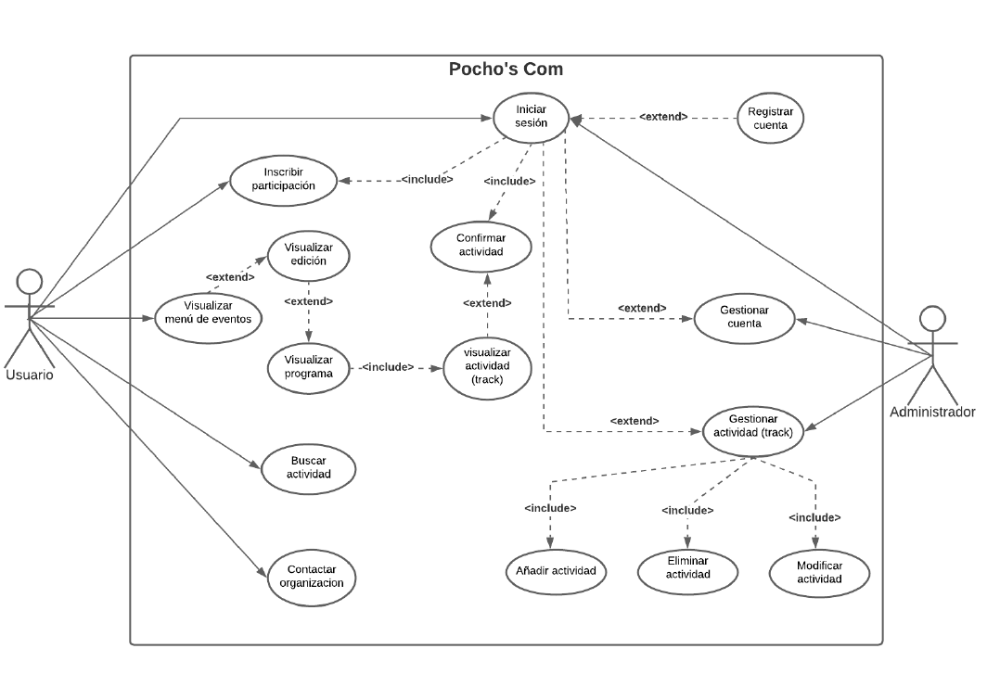
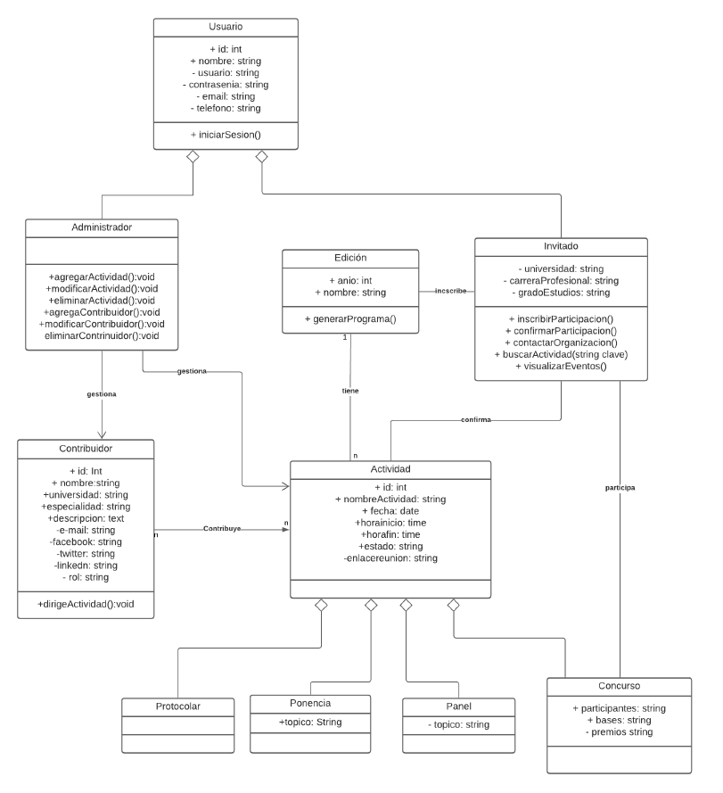
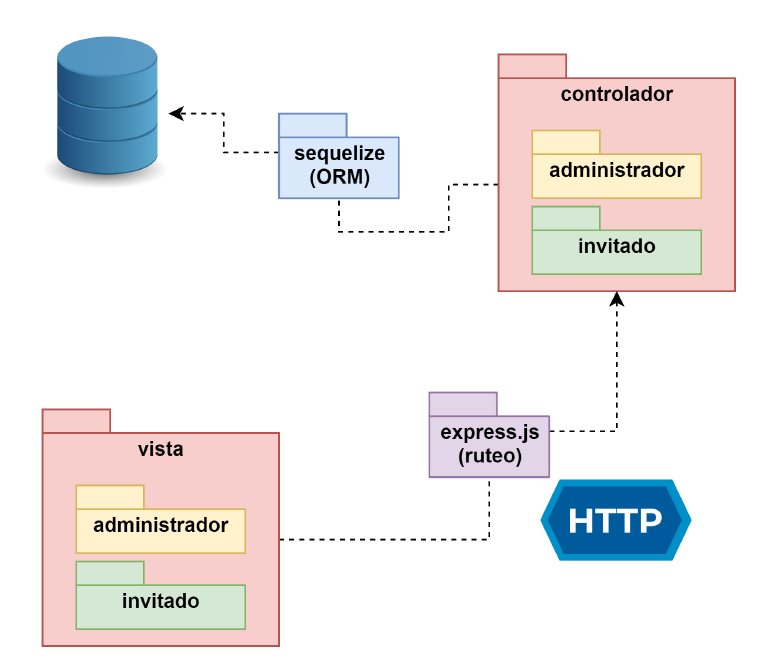
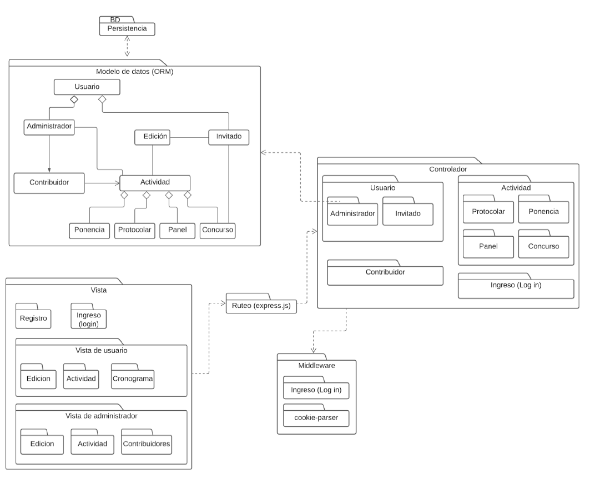

# Proyecto Pocho's Com.

## Descripción

El presente trabajo corresponde al proyecto final del curso de Ingeniería de Software 1 del programa de Ciencia de la Computación, para el cual se aplicó todos los conocimientos adquiridos para el desarrollo de un sistema con las prácticas y estándares propios del área Ingeniería de Software.

## Objetivo

### Objetivo general

1. El objetivo del siguiente proyecto es desarrollar un Sistema de Publicación de Proceedings de Eventos respetando los principios adquiridos a lo largo del curso.

### Objetivos especificos

1. En la fase de licitación, recopilar los aspectos funcionales y no funcionales del sistema mediante una exploración del estado del arte y sistemas afines.

2. En la fase de espacificación de requisitos de software (ERS), se construye el Documento de ERS de acuerdo al estándar IEE-830,  para los requisitos funcionales (RF) y no funcionales (RNF).

3. En la fase de diseño se determinan los modelos de datos (UML diagrama de clases), arquitecturales (IEEE-) y  procedimentales, ello en el marco de las buenas prácticas.

## Desarrollo

El sistema web en cuestión obedece al siguiente diagrama de Casos de Uso.

### Diseño de modelos de datos

### Diseño arquitectural

## Estilos de programación:

1. Kick Forward (Function composition):
    Variation of the Pipeline style, with the following additional constraints:
    
    Each function takes an additional parameter, usually the last, which is
    another function.
2. Things (Objects and Object Interaction):
    The larger problem is decomposed into things that make sense for the
    problem domain.

3. Constructivist (Adversity):
    Every single function checks the sanity of its arguments and either
    returns something sensible when the arguments are unreasonable or
    assigns them reasonable values.